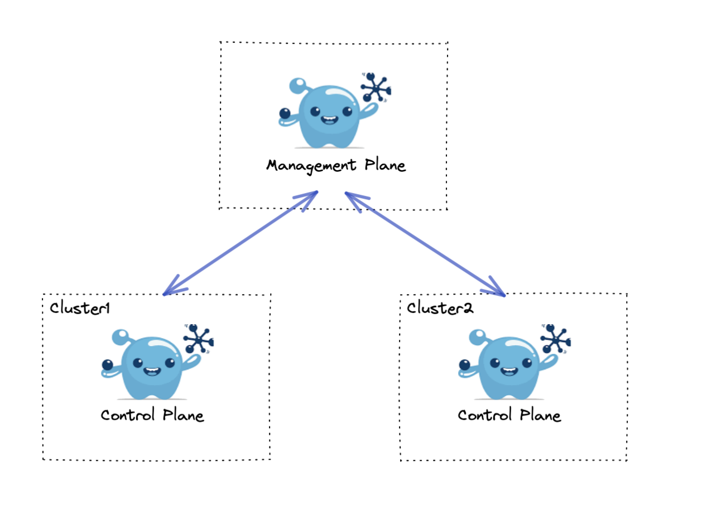
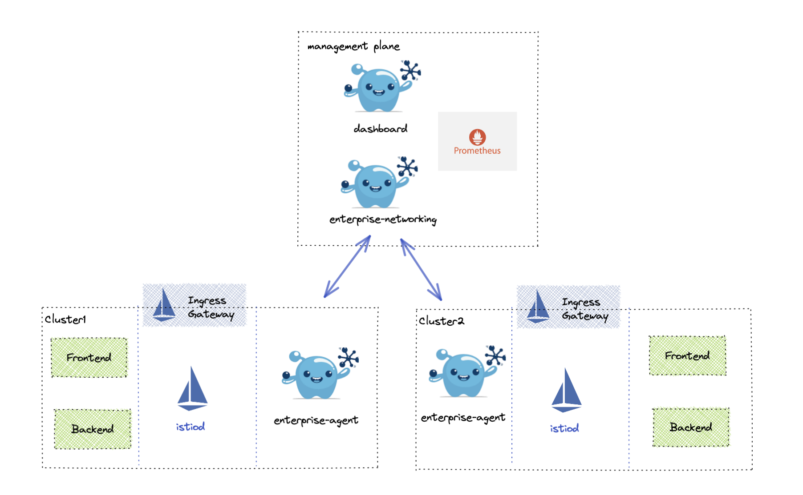

# Gloo Mesh Use Cases

This repository showcases typical Gloo Mesh use cases.  See below for categories of use cases.

- [Certificate Management](./cert-management/README.md)
- [Virtual Gateway Use Cases](./virtual-gateway/README.md)

## Cluster Setup

The default architecture will utilize a 3 cluster setup. The first cluster will be used to deploy the Gloo Mesh management plane and the following clusters will be used as "Client" or Control Plane clusters. Different setups may place these clusters in different regions as needed.

* Management Plane Cluster - Used to deploy Gloo Mesh Management Plane
    Name: mgmt
* Cluster1 - Used for installation of Istio and Gloo Mesh Control Plane
    Name: cluster1
* Cluster2 - Used for installation of Istio and Gloo Mesh Control Plane
    Name: cluster2

## Application Deployment

On the Management Plane we deploy the Gloo Mesh dashboard, prometheus, and the management plane controller known as `enterprise-networking`. 

On each Control Plane we deploy Istio and an ingress gateway and two simple applications `frontend` which calls `backend`. The Gloo Mesh Control Plane app responsible for communicating with the Management Plane is called `enterprise-agent`.

