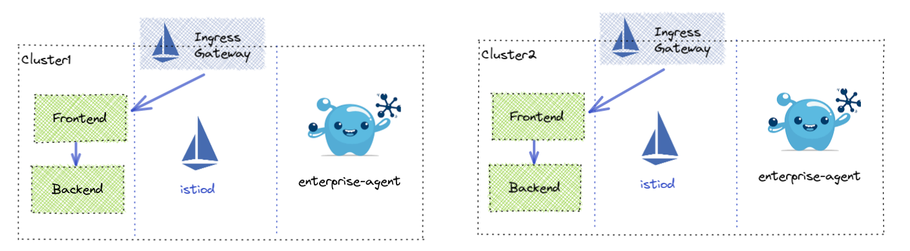

# In Mesh use cases

### Multi Cluster

This is the multi-cluster setup we will be utilizing. 

## Gloo Mesh Enterprise 1.x

### Traffic Policy

#### 1. Selectors
* 1.1 Source Selector
  * 1.1.1 Labels
  * 1.1.2 Namespace / Clusters
* 1.2 Destination Selector
  * 1.2.1 kubeServiceMatcher
  * 1.2.2 kubeServiceRefs
  * 1.2.3 virtualDestinationMatcher
  * 1.2.4 virtualDestinationRefs
  * 1.2.5 externalServiceMatcher - https://github.com/solo-io/gloo-mesh-enterprise/issues/2142
  * 1.2.6 externalServiceRefs - https://github.com/solo-io/gloo-mesh-enterprise/issues/2142

#### 2. Route Selectors - Skipped due to alternatives in VirtualHost/VirtualGateway/RouteTable

#### 3. HTTP Request Matchers
- 3.1 URI
  - 3.1.1 Exact match
  - 3.1.2 Prefix match
  - 3.1.3 Regex match
  - 3.1.4 Ignore case match
- 3.2 Header-based matching
  - 3.2.1 Name Match
  - 3.2.2 Name/Value Match
  - 3.2.3 Name/Regex Match
  - 3.2.4 Invert Match
- 3.3 Query parameter matching
  - 3.3.1 Key/Value match
  - 3.3.2 Regex Match
- 3.4 HTTP method matching

#### 4. Connection Pool Settings
- 4.1 HTTP
  - 4.1.1 http1MaxPendingRequests
  - 4.1.2 http2MaxRequests
  - 4.1.3 maxRequestsPerConnection
  - 4.1.4 maxRetries
  - 4.1.5 idleTimeout
  - 4.1.6 h2UpgradePolicyH2UpgradePolicy 		
  - 4.1.7 useClientProtocol
- 4.2 TCP
  - 4.2.1 maxConnections
  - 4.2.2 connectTimeout
  - 4.2.3 tcpKeepalive

#### 5. Traffic Shift
- 5.1 Weighted Destination

#### 6. Fault Injection
- 6.1 Delaying requests
- 6.2 Aborting requests
- 6.3 Faults for percentage of traffic

#### 7. Request Timeout / Retries
- 7.1 Timeouts
- 7.2 Retries

#### 8. CORS
- Setting allowed origins
- Allowed methods & headers
- Exposed headers
- Preflight request caching
- Access-Control-Allow-Credentials

#### 9. Mirroring
- Send percentage of traffic to mirrored destination (kubeService only)

#### 10. Header Manipulation
- Request Headers
  - Add Request Header
  - Remove Request Header
- Response Headers
  - Add Response Header
  - Remove Response Header

#### 11. Outlier Detection
- Outlier Detection for failover routing to a global destination

#### 12. mTLS
- Setting mTLS settings per destination

#### 13. CSRF
- Setting CSRF Policy
- Setting CSRF Policy

#### 14. Rate Limit
- Using raw Rate Limit definition
- Rate Limit on source cluster  (TODO does this make sense)
- Rate Limit on destination cluster (TODO use istio cluster name?)
- Rate Limit on request headers
- Rate Limit on remote address
- Rate Limit on generic key
- Rate Limit on the existence of a requst header
- Rate Limit on metadata
- Using separate Rate Limit config

#### 15. Ext Auth
- Using a custom auth server
- OIDC with AuthConfig
- Using an API token

### Virtual Destination

#### 1. Hostname
- Custom Hostname
- Override Kube Service

#### 2. Port Selection
- Custom Port

#### 3. Mesh Selection
- Single Mesh
- Multi-Mesh

#### 4. Static Destination

#### 5. Locality
- Outlier Detection

### Access Policy

#### 1. Source Selection
- kubeIdentityMatcher
- kubeServiceAccountRefs
- requestIdentityMatcher

#### 2. DestinationSelection
* Destination Selector
  * kubeServiceMatcher
  * kubeServiceRefs
  * virtualDestinationMatcher
  * virtualDestinationRefs
  * externalServiceMatcher
  * externalServiceRefs

#### 3. Allowed
- Paths
- Methods
- Ports

### 4. Service Dependencies
- Namespace Selection
- Cluster Selection
- Label Selectors