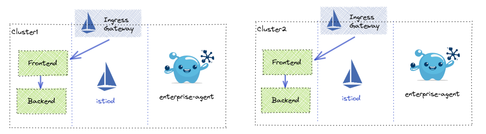

# Point to Point use cases

### Multi Cluster

This is the multi-cluster setup we will be utilizing. 

## Gloo Mesh Enterprise 1.x

### Traffic Policy

#### Selectors
* Source Selector
  * Labels
  * Namespace / Clusters
* Destination Selector
  * kubeServiceMatcher
  * kubeServiceRefs
  * virtualDestinationMatcher
  * virtualDestinationRefs
  * externalServiceMatcher - https://github.com/solo-io/gloo-mesh-enterprise/issues/2142
  * externalServiceRefs - https://github.com/solo-io/gloo-mesh-enterprise/issues/2142

#### Route Selectors - Skipped due to alternatives in VirtualHost/VirtualGateway/RouteTable

#### HTTP Request Matchers - TODO Deprecated?

#### Connection Pool Settings
- http
  - http1MaxPendingRequests
  - http2MaxRequests
  - maxRequestsPerConnection
  - maxRetries
  - idleTimeout
  - h2UpgradePolicyH2UpgradePolicy 		
  - useClientProtocol
- tcp
  - maxConnections
  - connectTimeout
  - tcpKeepalive

#### Traffic Shift
- Weighted Destination

#### Fault Injection
- Delaying requests
- Aborting requests
- Faults for percentage of traffic

#### Request Timeout / Retries
- Setting timeouts
- Adding retries 

#### CORS
- Setting allowed origins
- Allowed methods & headers
- Exposed headers
- Preflight request caching
- Access-Control-Allow-Credentials

#### Mirroring
- Send percentage of traffic to mirrored destination (kubeService only)

#### Header Manipulation
- Request Headers
  - Add Request Header
  - Remove Request Header
- Response Headers
  - Add Response Header
  - Remove Response Header

#### Outlier Detection
- Outlier Detection for failover routing to a global destination

#### mTLS
- Setting mTLS settings per destination

#### CSRF
- Setting CSRF Policy
- Setting CSRF Policy

#### Rate Limit
- Using raw Rate Limit definition
- Rate Limit on source cluster  (TODO does this make sense)
- Rate Limit on destination cluster (TODO use istio cluster name?)
- Rate Limit on request headers
- Rate Limit on remote address
- Rate Limit on generic key
- Rate Limit on the existence of a requst header
- Rate Limit on metadata
- Using separate Rate Limit config

#### Ext Auth
- Using a custom auth server
- OIDC with AuthConfig
- Using an API token

### Virtual Destination

#### Hostname
- Custom Hostname
- Override Kube Service

#### Port Selection
- Custom Port

#### Mesh Selection
- Single Mesh
- Multi-Mesh

#### Static Destination

#### Locality
- Outlier Detection

### Access Policy

#### Source Selection
- kubeIdentityMatcher
- kubeServiceAccountRefs
- requestIdentityMatcher

#### DestinationSelection
* Destination Selector
  * kubeServiceMatcher
  * kubeServiceRefs
  * virtualDestinationMatcher
  * virtualDestinationRefs
  * externalServiceMatcher
  * externalServiceRefs

#### Allowed
- Paths
- Methods
- Ports

### Service Dependencies
- Namespace Selection
- Cluster Selection
- Label Selectors