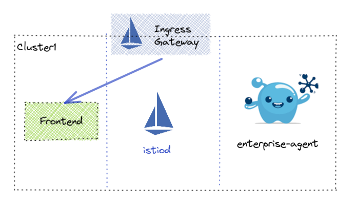
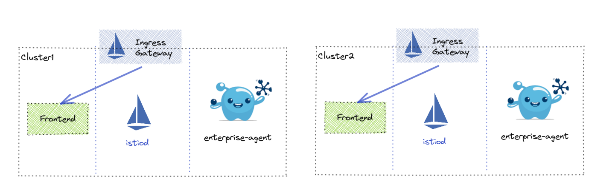

# Virtual Gateway Use Cases

Unless otherwise specified, these scenarios will assume the typical 3-cluster setup (mgmt, cluster1, cluster2) so that it will work in any environment.  This also assumes the following pre-requisites:

- Gloo Mesh Management Plane is installed 
- Remote Clusters are registered
- Istio is installed with at least version 1.10

If there are any deviations from the above, then a README should be supplied along with scripts to take care of the changes.

## Setup

A majority of the tests will utilize this simple setup of a `frontend` application running in the `app` namespace.


### Single Cluster

* The `frontend` application can be reached via
```
http://frontend.app.svc.cluster.local:8080
```




### Multi Cluster

This is the multi-cluster setup we will be utilizing. 




## Gloo Mesh Enterprise 1.x

### 1. Ingress Gateway Scenarios
- 1.1 [Basic Application Ingress for Single Cluster](./v1-api/1-ingress-gateway/1.1-basic-single-cluster.yaml)
- 1.2 Single Virtual Gateway attached to multiple Ingress Gateways
  - 1.2.1 [Label Selector](./v1-api/1-ingress-gateway/1.2.1-multi-gateway-label-selector.yaml)
  - 1.2.2 [Specific Cluster Selector using multiple kubeServiceRefs](./v1-api/1-ingress-gateway/1.2.2-multi-gateway-cluster-selector.yaml)
  - 1.2.3 [Cluster Selector using multiple kubeServiceRefs.services](./v1-api/1-ingress-gateway/1.2.3-multi-cluster-multi-gateway.yaml) 
- 1.3 [Multi-cluster Virtual Gateway](./v1-api/1-ingress-gateway/1.3-multi-gateway-multiple-cluster.yaml)
- 1.4 [Gateway not in istio-system namespace](./v1-api/1-ingress-gateway/1.4-multi-gateway-label-selector.yaml)

### 2. Connection Handling
- 2.1 [Protocol Selection](./v1-api/2-connection-handling/2.1-transport-protocol.yaml)
- 2.2 [Virtual Gateway TLS termination](./v1-api/2-connection-handling/2.2-tls-termination.yaml)
- 2.3 [HTTPS Redirect](./v1-api/2-connection-handling/2.3-https-redirect.yaml)
- 2.4 [Restricting Envoy filters](./v1-api/2-connection-handling/2.4-restricting-envoy-filters.yaml)
- 2.5 [SNI matching](./v1-api/2-connection-handling/2.5-sni-matching.yaml)
- 2.6 [Wildcard domains](./v1-api/2-connection-handling/2.6-sni-wildcard-matching.yaml)
- 2.7 [Proxy Protocol](./v1-api/2-connection-handling/2.7-proxy-protocol.yaml)

### 3 Virtual Hosts
- 3.1 [VirtualGateway selection](./v1-api/3-virtual-hosts/3.1-virtual-gateway-selection.yaml)

### 4 Route matching
- 4.1 Path-based matching
  - 4.1.1 [Prefix](./v1-api/4-route-matching/4.1.1-prefix-path-match.yaml)
  - 4.1.2 [Exact](./v1-api/4-route-matching/4.1.2-exact-path-match.yaml)
  - 4.1.3 [Regex](./v1-api/4-route-matching/4.1.3-regex-path-match.yaml)
  - 4.1.4 [Suffix](./v1-api/4-route-matching/4.1.4-suffix-path-match.yaml)
  - 4.1.5 [Prefix Ignore Case](./v1-api/4-route-matching/4.1.5-prefix-ignore-case-path-match.yaml)
- 4.2 Header-based matching
  - 4.2.1 [Name Match](./v1-api/4-route-matching/4.2.1-header-name-match.yaml)
  - 4.2.2 [Name/Value Match](./v1-api/4-route-matching/4.2.2-header-value-match.yaml)
  - 4.2.3 [Name/Regex Match](./v1-api/4-route-matching/4.2.3-header-value-regex-match.yaml)
  - 4.2.4 [Invert Match](./v1-api/4-route-matching/4.2.4-header-value-invert-match.yaml)
- 4.3 Query parameter matching
  - 4.3.1 [Key/Value match](./v1-api/4-route-matching/4.3.1-query-value-match.yaml)
  - 4.3.2 [Regex Match](./v1-api/4-route-matching/4.3.2-query-value-regex-match.yaml)
- 4.4 [HTTP method matching](./v1-api/4-route-matching/4.4-method-match.yaml)

### 5 Routing to Destination
- 5.1 [Single destination](./v1-api/5-destination-routing/5.1-single-destination.yaml)
- 5.2 [Weighted destination](./v1-api/5-destination-routing/5.2-weighted-destination.yaml)
- 5.3 [Routing to service with multiple ports (kubeService only)](./v1-api/5-destination-routing/5.3-multi-port-destination.yaml)
- 5.4 [Multi-cluster routing (kubeService only)](./v1-api/5-destination-routing/5.4-multi-cluster-destination.yaml)
- 5.5 [Using cluster_header](./v1-api/5-destination-routing/5.5-cluster-header-destination.yaml)
- 5.6 [Subset routing](./v1-api/5-destination-routing/5.6-subset-routing.yaml)
- 5.7 [Route to VirtualDestination](./v1-api/5-destination-routing/5.7-virtual-destination.yaml)
- 5.8 [Route to Static Destination](./v1-api/5-destination-routing/5.8-static-destination.yaml)
- 5.9 Per Destination Request Headers
  - 5.9.1 [Add Request Header](./v1-api/5-destination-routing/5.9.1-add-destination-request-headers.yaml)
  - 5.9.2 [Remove Request Header](./v1-api/5-destination-routing/5.9.2-remove-destination-request-header.yaml)
- 5.10 Per Destination Response Headers
  - 5.10.1 [Add Response Header](./v1-api/5-destination-routing/5.10.1-add-destination-response-headers.yaml)
  - 5.10.2 [Remove Response Header](./v1-api/5-destination-routing/5.10.2-remove-destination-response-header.yaml)
- 5.11 Per Route Request Headers
  - 5.11.1 [Add Request Header](./v1-api/11-timeouts/11.1.1-route-timeout.yaml)
  - 5.11.2 [Remove Request Header](./v1-api/5-destination-routing/5.11.2-remove-route-request-header.yaml)
- 5.12 Per Route Response Headers
  - 5.12.1 [Add Response Header](./v1-api/5-destination-routing/5.12.1-add-route-response-headers.yaml)
  - 5.12.2 [Remove Response Header](./v1-api/5-destination-routing/5.12.2-remove-route-response-header.yaml)
- 5.13 Path rewrite

### 6 Redirects
- 6.1 [Host Redirect](./v1-api/6-redirects/6.1-host-redirect.yaml)
- 6.2 [Path Redirect](./v1-api/6-redirects/6.2-path-redirect.yaml)
- 6.3 [Rewrite Path Prefix](./v1-api/6-redirects/6.3-prefix-rewrite.yaml)
- 6.4 [Modifying the response code](./v1-api/6-redirects/6.4-modify-response-code.yaml)
- 6.5 [HTTP to HTTPS redirect](./v1-api/6-redirects/6.5-https-redirect.yaml)
- 6.6 [Strip query](./v1-api/6-redirects/6.6-strip-query.yaml)

### 7 Direct Response
- 7.1 [Return a direct response without routing](./v1-api/7-direct-response/7.1-direct-response.yaml)

### 8 Routing delegation
- 8.1 [Select RouteTable by name/namespace](./v1-api/8-route-delegation/8.1-namespace-selector.yaml)
- 8.2 [Select RouteTable by selector](./v1-api/8-route-delegation/8.2-label-selector.yaml)
- 8.3 [Sort RouteTables by weight](./v1-api/8-route-delegation/8.3-weighted-routes.yaml)
- 8.4 [Sort RouteTables by specificity](./v1-api/8-route-delegation/8.4-specify-route-order.yaml)

### 9 Traffic Shifting
- 9.1 [Weighted Destination](./v1-api/9-traffic-shifting/9.1-weighted-destination.yaml)

### 10 Fault Injection
- 10.1 Delaying requests
  - 10.1.1 [Route delay](./v1-api/10-fault-injection/10.1.1-route-delay.yaml)
  - 10.1.2 [Host delay](./v1-api/10-fault-injection/10.1.2-host-delay.yaml)
- 10.2 Aborting requests
  - 10.1.2 [Route abort](./v1-api/10-fault-injection/10.2.1-route-abort.yaml)
  - 10.2.2 [Host abort](./v1-api/10-fault-injection/10.2.2-host-abort.yaml)
- 10.3 Faults for percentage of traffic
  - 10.3.1 [Route abort by percentage](./v1-api/10-fault-injection/10.3.1-route-abort-percent.yaml)
  - 10.3.2 [Host abort by percentage](./v1-api/10-fault-injection/10.3.2-host-abort-percent.yaml)

### 11 Handling timeouts
- 11.1 Setting timeouts
  - 11.1.1 [Route timeout](./v1-api/11-timeouts/11.1.1-route-timeout.yaml)
  - 11.1.2 [Host timeout](./v1-api/11-timeouts/11.1.2-host-timeout.yaml)
- 11.2 Adding retries 
  - 11.2.1 [Route retries](./v1-api/11-timeouts/11.2.1-route-retries.yaml)
  - 11.2.2 [Host retries](./v1-api/11-timeouts/11.2.2-host-retries.yaml)

### 12 CORS
- 12.1 Setting allowed origins
  - 12.1.1 [By route](./v1-api/12-cors/12.1.1-route-allowed-origins.yaml)
  - 12.1.2 [By host](./v1-api/12-cors/12.1.2-host-allowed-origins.yaml)
- 12.2 Allowed methods 
  - 12.2.1 [By route](./v1-api/12-cors/12.2.1-route-allowed-methods-headers.yaml)
  - 12.2.2 [By host](./v1-api/12-cors/12.2.1-route-allowed-methods-headers.yaml)
- 12.3 Exposed 
  - 12.3.1 [By route](./v1-api/12-cors/12.3.1-route-exposed-headers.yaml)
  - 12.3.2 [By host](./v1-api/12-cors/12.3.2-host-exposed-headers.yaml)
- 12.4 Preflight request caching
  - 12.4.1 [By route](./v1-api/12-cors/12.4.1-route-preflight-request-caching.yaml)
  - 12.4.2 [By host](./v1-api/12-cors/12.4.2-host-preflight-request-caching.yaml)
- 12.5 Access-Control-Allow-Credentials
  - 12.5.1 [By route](./v1-api/12-cors/12.5.1-route-allow-credentials.yaml)
  - 12.5.2 [By host](./v1-api/12-cors/12.5.2-host-allow-credentials.yaml)

### 13 Mirroring Traffic
- 13.1 Send percentage of traffic to mirrored destination (kubeService only)
  - 13.1.1 [By route](./v1-api/13-mirroring/13.1.1-route-mirroring.yaml)
  - 13.1.2 [By host](./v1-api/13-mirroring/13.1.2-host-mirroring.yaml)

### 14 Outlier Detection
- 14.1 [Outlier Detection for failover routing to a global destination](./v1-api/14-outlier-detection/14.1-outlier-detection.yaml)

### 15 Istio mTLS Settings
- 15.1 [Setting mTLS settings per ](./v1-api/15-mtls-settings/15.1-mtls-settings.yaml)

### 16 Cross-Site Request Forgery (TrafficPolicy)
- 16.1 [Setting CSRF Policy](./v1-api/16-csrf/16.1-csrf-enabled.yaml)
- 16.2 [Setting CSRF Policy](./v1-api/16-csrf/16.2-csrf-shadow-enabled.yaml)

### 17 Rate Limiting (TrafficPolicy)
- 17.1 Using raw Rate Limit definition
- 17.2 Rate Limit on source cluster  (TODO does this make sense)
- 17.3 Rate Limit on destination cluster (TODO use istio cluster name?)
- 17.4 Rate Limit on request headers
- 17.5 Rate Limit on remote address
- 17.6 Rate Limit on generic key
- 17.7 Rate Limit on the existence of a requst header
- 17.8 Rate Limit on metadata
- 17.9 Using separate Rate Limit config

### 18 External Auth (TrafficPolicy)
- 18.1 Using a custom auth server
- 18.2 OIDC with AuthConfig
- 18.3 Using an API token

### 19 Labeled routes (TrafficPolicy)
- 19.1 Specifying route labels for a TrafficPolicy

### 20 Rate Limiting (RouteTable)
- 20.1 Using raw Rate Limit definition
- 20.2 Rate Limit on source cluster
- 20.3 Rate Limit on destination cluster
- 20.4 Rate Limit on request headers
- 20.5 Rate Limit on remote address
- 20.6 Rate Limit on generic key
- 20.7 Rate Limit on the existence of a requst header
- 20.8 Rate Limit on metadata
- 20.9 Using separate Rate Limit config

### 21 External Auth (RouteTable)
- 21.1 Using a custom auth server
- 21.2 OIDC with AuthConfig
- 21.3 Using an API token

### 22 Cross-Site Request Forgery (RouteTable)
- 22.1 Setting CSRF Policy
- 22.2 Setting CSRF Policy

### 23 TCP Destinations
- 23.1 Configuring a static TCP Destination
- 23.2 Configuring a virtual TCP Destination
- 23.3 Configuring a kube TCP Destination
- 23.4 Forwarding SNI
- 23.5 Weighted routing

### 24 TCP Options
- 24.1 Setting max connection attempts
- 24.2 Setting idle timeout
- 24.3 Using a TCP tunnel

### 25 Global Virtual Gateway options
- 25.1 Setting a limit on connection buffers
- 25.2 Setting the bind address