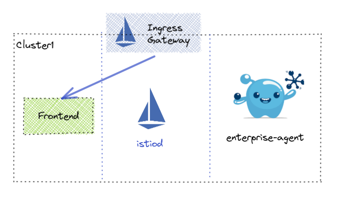
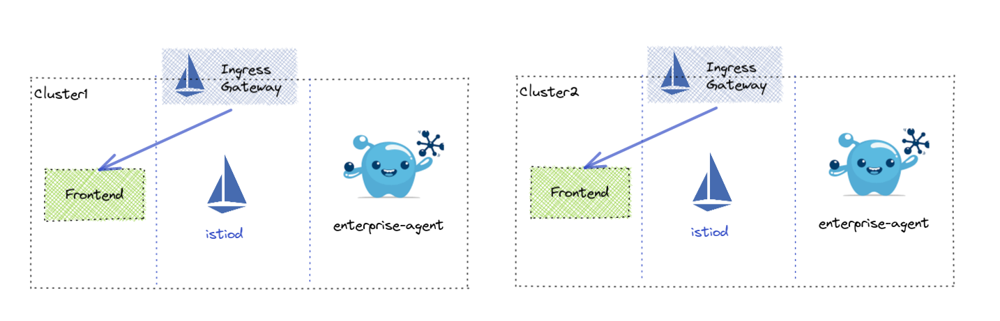

# Virtual Gateway Use Cases

Unless otherwise specified, these scenarios will assume the typical 3-cluster setup (mgmt, cluster1, cluster2) so that it will work in any environment.  This also assumes the following pre-requisites:

- Gloo Mesh Management Plane is installed 
- Remote Clusters are registered
- Istio is installed with at least version 1.10
- Bookinfo is deployed to clusters 1 and 2 as stated in the Gloo Mesh workshop
- Bookinfo Gateway and VirtualService are not installed 

If there are any deviations from the above, then a README should be supplied along with scripts to take care of the changes.

## Setup

A majority of the tests will utilize this simple setup of a `frontend` application running in the `app` namespace.


### Single Cluster

* The `frontend` application can be reached via
```
http://frontend.app.svc.cluster.local:8080
```




### Multi Cluster

This is the multi-cluster setup we will be utilizing. 




## Gloo Mesh Enterprise 1.x

### 1. Ingress Gateway Scenarios
- 1.1 Basic Application Ingress for Single Cluster
- 1.2 Single Virtual Gateway attached to multiple Ingress Gateways
  - 1.2.1 Label Selector
  - 1.2.2 Specific Cluster Selector using multiple kubeServiceRefs
  - 1.2.3 Cluster Selector using multiple kubeServiceRefs.services 
- 1.3 Multi-cluster Virtual Gateway
- 1.4 Gateway not in istio-system namespace

### 2. Connection Handling
- 2.1 Protocol Selection
- 2.2 Virtual Gateway TLS termination
- 2.3 HTTPS Redirect
- 2.4 Restricting Envoy filters
- 2.5 SNI matching
- 2.6 Wildcard domains
- 2.7 Proxy Protocol

### 3 Virtual Hosts
- 3.1 VirtualGateway selection

### 4 Route matching
- 4.1 Path-based matching
  - 4.1.1 Prefix
  - 4.1.2 Exact
  - 4.1.3 Regex
  - 4.1.4 Suffix
  - 4.1.5 Prefix Ignore Case
- 4.2 Header-based matching
  - 4.2.1 Name Match
  - 4.2.2 Name/Value Match
  - 4.2.3 Name/Regex Match
  - 4.2.4 Invert Match
- 4.3 Query parameter matching
  - 4.3.1 Key/Value match
  - 4.3.2 Regex Match
- 4.4 HTTP method matching

### 5 Routing to Destination
- 5.1 Single destination
- 5.2 Weighted destination
- 5.3 Routing to service with multiple ports (kubeService only)
- 5.4 Multi-cluster routing (kubeService only)
- 5.5 Using cluster_header
- 5.6 Subset routing
- 5.7 Route to VirtualDestination
- 5.8 Route to Static Destination
- 5.9 Per Destination Request Headers
  - 5.9.1 Add Request Header
  - 5.9.2 Remove Request Header
- 5.10 Per Destination Response Headers
  - 5.10.1 Add Response Header
  - 5.10.2 Remove Response Header
- 5.11 Per Route Request Headers
  - 5.11.1 Add Request Header
  - 5.11.2 Remove Request Header
- 5.12 Per Route Response Headers
  - 5.12.1 Add Response Header
  - 5.12.2 Remove Response Header

- 5.13 Path rewrite

### 6 Redirects
- 6.1 Host Redirect
- 6.2 Path Redirect
- 6.3 Rewrite Path Prefix
- 6.4 Modifying the response code
- 6.5 HTTP to HTTPS redirect
- 6.6 Strip query

### 7 Direct Response
- 7.1 Return a direct response without routing

### 8 Routing delegation
- 8.1 Select RouteTable by name/namespace
- 8.2 Select RouteTable by selector
- 8.3 Sort RouteTables by weight
- 8.4 Sort RouteTables by specificity

# 9 Traffic Shifting
- 9.1 Weighted via subsets
- 9.2 Routing to service with multiple ports (kubeService only)
- 9.3 Multi-cluster routing (kubeService only)
- 9.4 Using cluster_header
- 9.5 Subset routing
- 9.6 Route to VirtualDestination
- 9.7 Route to Static Destination
- 9.8 Request transformation (add/remove headers)
- 9.9 Response transformation (add/remove headers)
- 9.10 Path rewrite

# 10 Fault Injection
- 10.1 Delaying requests
- 10.2 Aborting requests
- 10.3 Faults for percentage of traffic

# 11 Handling timeouts
- 11.1 Setting timeouts
- 11.2 Adding retries 

# 12 CORS
- 12.1 Setting allowed origins
- 12.2 Allowed methods & headers
- 12.3 Exposed headers
- 12.4 Preflight request caching
- 12.5 Access-Control-Allow-Credentials

# 13 Mirroring Traffic
- 13.1 Send percentage of traffic to mirrored destination (kubeService only)

# 14 Header Manipulation
- 14.1 Request Transformation on TrafficPolicy (add/remove headers)
- 14.1 Response Transformation on TrafficPolicy (add/remove headers)

# 15 Outlier Detection
- 15.1 Outlier Detection for failover routing to a global destination

# 16 Istio mTLS Settings
- 16.1 Setting mTLS settings per destination

# 17 Cross-Site Request Forgery
- 17.1 Setting CSRF Policy

# 18 Rate Limiting
- 18.1 Using raw Rate Limit definition
- 18.2 Rate Limit on source cluster
- 18.3 Rate Limit on destination cluster
- 18.4 Rate Limit on request headers
- 18.5 Rate Limit on remote address
- 18.6 Rate Limit on generic key
- 18.7 Rate Limit on the existence of a requst header
- 18.8 Rate Limit on metadata
- 18.9 Using separate Rate Limit config

# 19 External Auth
- 19.1 Using a custom auth server
- 19.2 OIDC with AuthConfig
- 19.3 Using an API token

# 20 Labeled routes
- 20.1 Specifying route labels for a TrafficPolicy

# 21 TCP Destinations
- 21.1 Configuring a static TCP Destination
- 21.2 Configuring a virtual TCP Destination
- 21.3 Configuring a kube TCP Destination
- 21.4 Forwarding SNI
- 21.5 Weighted routing

# 22 TCP Options
- 22.1 Setting max connection attempts
- 22.2 Setting idle timeout
- 22.3 Using a TCP tunnel

# 24 Global Virtual Gateway options
- 24.1 Setting a limit on connection buffers
- 24.2 Setting the bind address